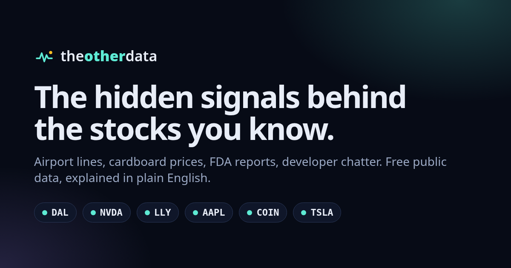

# The Other Data

**Live:** [theotherdata.com](https://theotherdata.com) (preview: [theotherdata.vercel.app](https://theotherdata.vercel.app)) · Built by [Nick Castro](https://nickcastrobuilds.com)

> Wall Street pays millions for "alternative data". This project pulls the free, public versions (airport security lines, cardboard box prices, FDA reports, what people look up on Wikipedia, developer chatter) and explains in plain English what they might mean for 33 well-known stocks.



**Not financial advice. For education only.**

## What it does

- **105 live signals across 33 stocks.** Examples: TSA checkpoint counts and jet fuel prices for Delta and United, PyTorch downloads and Hacker News chatter for Nvidia, NHTSA owner complaints for Tesla and Ford, openFDA adverse-event reports as an adoption proxy for Eli Lilly and Novo Nordisk, corrugated box prices and AWS toolkit installs for Amazon, egg and beef prices for McDonald's, coffee bean and milk prices for Starbucks, sugar and aluminum (can) prices for Coca-Cola, Gemini SDK installs for Alphabet, Shopify app-toolkit installs (npm) for Shopify, new aircraft orders and airline load factors for Boeing, credit card delinquencies and business-loan growth for JPMorgan, and public job-board snapshots (Greenhouse, Lever) for Coinbase, Airbnb, Roblox, and Palantir. Wikipedia pageviews drop isolated one-day bot bursts (and say so in the source note) so a single automated spike can't fake a curiosity surge.
- **A 10-second home page.** The hero shows one real example straight from the latest refresh: what the data is, its green/red change, which way it leans, and why it matters. `public/featured.js` picks it: Amazon cardboard box prices lead whenever that reading is live and directional, then the card rotates through the strongest offbeat moves (one per stock, no repeated series, outliers over 150% skipped). It never hardcodes a number.
- **A track record that can be checked.** Every scheduled refresh appends each curated stock's overall lean (tailwind / headwind / mixed / quiet, with strength) and its price to an append-only log (`data/track/live.jsonl`, one line per stock per day). `scripts/track-record.mjs` scores those leans against Tiingo adjusted closes over 2 weeks, 1 month, and 1 quarter, on their own and vs the S&P 500 (SPY), and the [/track](https://theotherdata.com/track) page shows hit rates with sample sizes. A separate, clearly labeled **backtest** (`data/track/backtest.json`) rebuilds monthly leans since Jan 2023 using only signals with dated public history, conservative publication delays, and SEC numbers by first filing date. Signals that can't be backtested honestly (PyPI's 180-day window, npm's ~18-month window, FDA reports, NHTSA complaints, job-board snapshots) are left out and listed with the reason. The current backtest result is about a coin flip, and the page says so.
- **Built for beginners.** Every stock page has a "How to read this page" button that opens a 12-step guided tour (`public/tour.js`, no libraries, about 16 KB unminified). It spotlights the real elements on the page: a signal card, the green/red change tag vs the tailwind/headwind reading (including signals that flip, like inventory or complaints), the lean, its strength and "weeks to a quarter" window, the AI summary, the source and "data through" date, and the track record with its coin-flip result. Steps use the live numbers on the page. It works with the keyboard (Esc, arrow keys, focus trap) and becomes a bottom sheet on phones. First-time visitors get a small, dismissible invite instead of a pop-up, and the choice is remembered in `localStorage`. [/how-to-read](https://theotherdata.com/how-to-read) is the same material as a static page, filled with live examples from Amazon's data and the backtest. Any link to `/?tour=1#/AMZN` starts the tour.
- **A weekly "strangest signals" email.** Signup forms on the home page, every footer, the end of the guided tour, and [/subscribe](https://theotherdata.com/subscribe). Double opt-in (the confirm link opens a page with one button, so mail-app link scanners can't confirm for someone), one-click unsubscribe (RFC 8058 `List-Unsubscribe-Post` plus a footer link), and unsubscribing deletes the address. Spam protection: a honeypot field, a minimum fill time, a same-origin check, and per-connection rate limits that never store IPs. Subscribers live in a private Vercel Blob store as one JSON file per address hash. Links carry a signed hash, never the address. `lib/digest.js` builds each issue from the published data only: the 3–5 strangest live moves (same offbeat ranking as the hero, one per stock), one plain-English story, and the backtest's coin-flip result. [/digest](https://theotherdata.com/digest) previews the current issue. A daily Vercel Cron (`api/digest.js`) sends it on Mondays in chunks under Resend's free 100/day cap, never twice to the same person. It stays in dry-run mode until sending is switched on explicitly.
- **No buy/sell calls, even borrowed ones.** Third-party headlines that make buy/sell calls ("Now Is the Perfect Time to Buy…") are moved into a collapsed, labeled "third-party opinion" group on stock pages (`public/news-filter.js`).
- **Every signal card answers three questions:** what the data is, why it might matter for this company, and what it's showing now. The last one is written from the actual numbers.
- **Each signal gets a reading.** It's compared with its own recent past (28 days vs the prior 28, or year over year for seasonal data), then classed as a tailwind, headwind, neutral (inside a per-signal noise band), or context (the effect cuts both ways).
- **Context panels** on each stock page: latest news, SEC filings with plain-English 8-K labels, insider (Form 4) filing counts, and an optional price chart.
- **Search any US-listed stock or ETF.** A directory of ~14,000 symbols (Nasdaq, NYSE, NYSE American, NYSE Arca, Cboe, IEX, TXSE, plus SEC-reporting OTC companies) powers instant, typo-tolerant suggestions by ticker or partial name ("rocket lab", "lemonade", "soundhound"). The 33 curated names open their deep-signal pages; everything else opens a light pack (price, chart, news, Wikipedia curiosity, HN chatter, SEC filings) built on demand by `/api/lookup`, with an explicit "Limited data" notice when our free sources have little.
- **Refreshes itself.** A scheduled GitHub Actions job pulls every source every 4 hours and commits the data, and each commit redeploys on Vercel. Every card shows when its data was fetched and what period it covers.

## Engineering choices worth a look

| Problem | Approach |
| --- | --- |
| Never show made-up numbers | Each signal is `ok`, `stale` (last good data, with a warning and its fetch time), `tracking` (history still building), or `error` (shown as "Data unavailable"). A test checks that error cards carry no numbers. |
| Be a polite scraper | Official APIs and public downloads only, robots.txt checked for each source. Requests are spaced per host (GDELT 7 s, FRED 1.2 s, SEC 0.2 s), retry with backoff, and have hard timeouts that also cover the response body. |
| A flaky upstream (GDELT returns 429 a lot) | GDELT calls are serialized behind a circuit breaker (3 straight failures or a 7-minute budget, then skip), with fallbacks to the last good headlines and to Hacker News stories filtered to titles that name the company. |
| Sources that only show "today" (job boards) | The refresh job saves a snapshot each run in `data/history.json` and builds the trend itself. |
| AI that stays honest | Optional Gemini summary per stock. The prompt hands the model the page's computed lean, strength and time window and requires it to agree. Output is rejected if it is too long, adds numbers, sounds like investment advice ("price target", "will rise", "you should sell"…, while ordinary words like "bulk-buying" pass), or states a different overall direction than the page (e.g. "mixed" on a tailwind page). One retry per model with the rejection reason, then a template built from the same lean. `node scripts/resummarize.mjs` re-checks shipped summaries without refetching data. |
| Links that unfurl when shared | The build (`scripts/cards.mjs`) draws a branded card for every curated stock and signal with satori + resvg (1200×630 for X/LinkedIn, 1080×1920 for TikTok/Stories) and writes crawler-readable permalink pages, `/s/AMZN` and `/s/AMZN/cardboard`, with og:image/twitter:image tags. No git bloat (cards live only in the deploy), no runtime function, and every 4-hour data commit redeploys fresh cards. Stock pages get a Share menu: copy link, X, LinkedIn, download either card. |
| Keys never leak | Provider keys go in request headers, not URLs. Error messages carry only the host. Keys live in GitHub Actions secrets. |
| Find obscure tickers | `public/data/symbols.json` is built from the Nasdaq Trader symbol directory (`nasdaqlisted.txt`, `otherlisted.txt`) and SEC `company_tickers_exchange.json` (for CIKs and SEC-reporting OTC names), dropping test issues, warrants, rights, SPAC units, preferreds and notes. The same ranking code (`public/symbol-search.js`) runs in the browser and in `/api/search`: exact ticker → alias → name prefix → ticker prefix → word prefix → contains → fuzzy. Refreshed weekly by the scheduled workflow, with a guard that refuses to replace the file with a much smaller one. |
| Fast and cheap | Static site (vanilla JS, no framework, no web fonts, strict CSP). Data is precomputed JSON, so there are no runtime servers or databases. |

## Data sources

FRED (St. Louis Fed: Census, BLS, BTS, EIA and Freddie Mac series) · SEC EDGAR (XBRL inventory, filings) · openFDA · NHTSA complaints API · TSA checkpoint numbers · Wikimedia pageviews · PyPI downloads (pypistats) · Hacker News (Algolia) · Greenhouse public job boards · GDELT news. Optional, keyed: Finnhub (company news, quotes), Tiingo (end-of-day prices), Gemini (summaries).

## Project layout

```
lib/catalog.js      tickers → signals (metric, polarity, noise band, plain-English copy)
lib/sources.js      one adapter per source; keyed providers switch on via env vars
lib/http.js         polite fetch (User-Agent, per-host spacing, retries, timeouts)
lib/analyze.js      comparisons, readings, template explanations, summaries
lib/explain.js      optional Gemini summary with validation and fallback
scripts/refresh.mjs pulls everything, writes public/data/*.json
scripts/build-symbols.mjs  US symbol directory → public/data/symbols.json (weekly)
lib/symbol-directory.js    parses Nasdaq Trader + SEC ticker files
lib/symbols.js             server-side directory search (shared ranking: public/symbol-search.js)
public/             the static site (index, stock pages via #/TICKER, /how, /track, /how-to-read; tour.js = guided tour)
.github/workflows/refresh.yml   every 4 hours: refresh → test → commit → Vercel deploy
test/               node:test (analysis, data integrity, provider parsing and key safety)
```

## Run it locally

```bash
node scripts/refresh.mjs                         # all tickers (~5–8 min; GDELT is slow)
node scripts/refresh.mjs --only AAPL,NVDA --skip-news
node scripts/build-symbols.mjs                   # refresh the US symbol directory (~2 s)
node dev-server.mjs                              # http://localhost:3000
node --test test/*.test.js
```

Node 20+, then `npm install` once. To try the digest signup flow locally without real storage or email: `TOD_SUBS_FILE=/tmp/subs.json TOD_EMAIL_OUTBOX=/tmp/outbox node dev-server.mjs` (messages are written to files, nothing is sent). `node scripts/digest.mjs --preview` writes the current issue to `reports/digest-preview.html` and `.txt`.

## Optional keys (GitHub repo → Settings → Secrets and variables → Actions)

| Secret | Turns on | Free signup |
| --- | --- | --- |
| `GEMINI_API_KEY` | AI summary per stock | https://aistudio.google.com/apikey |
| `FINNHUB_API_KEY` | Company news + current quote | https://finnhub.io/register |
| `TIINGO_API_KEY` | End-of-day price chart (1 year) | https://www.tiingo.com/account/api/token |

Without them the site still works. It uses GDELT and Hacker News for news, template explanations, and links out for prices.

## Weekly digest settings (Vercel → Project → Settings → Environment Variables)

| Variable | What it does |
| --- | --- |
| `BLOB_READ_WRITE_TOKEN` | Added automatically when a private Blob store is connected to the project. Without it, signup forms show "opening soon" and save nothing. |
| `RESEND_API_KEY` | Turns on confirmation emails (Resend free plan: 3,000/month, 100/day). Needs `theotherdata.com` verified in Resend. |
| `CRON_SECRET` | Any long random string. Vercel Cron sends it to `/api/digest`; every other caller gets 401. |
| `DIGEST_SEND_ENABLED` | Must be exactly `true` before any digest goes to subscribers. Until then the cron only logs a dry run. |
| `DIGEST_TEST_TO` | Optional: with the key and secret set but sending not enabled, each new issue goes only to this address, for a first look. |
| `DIGEST_FROM`, `DIGEST_REPLY_TO`, `DIGEST_DAILY_CAP`, `DIGEST_SEND_DAY` | Optional. Defaults: `The Other Data <digest@theotherdata.com>`, no reply-to, 90 per day, `mon`. |

## Deploy

Vercel, linked to this repo (framework: Other, build `node scripts/build.mjs`, output `dist`). Domains: `theotherdata.com`, with `www` redirecting to the apex. Optional Vercel env vars: `GA_MEASUREMENT_ID` and `GOOGLE_SITE_VERIFICATION`, applied at build time.

## License and disclaimer

Code © Nick Castro. Data belongs to its publishers; see each card's source link. Nothing here is a recommendation to buy, sell, or hold any security.
